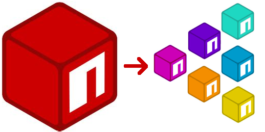

# Smaller Package Alternatives

> A curated list of smaller alternatives to common Node.js modules.

## Packages

| Package           | Alternatives    |
| :---------------- | :-------------- |
| lodash            | angus-c/just    |
| moment.js         | dayjs           |
| React/Vue/Angular | svelte          |
| FlatPickr         | svelte-calendar |
| FontAwesome       | feather-icons   |

## Packages needing smaller alternatives

- bn.js

## Related lists:

- [awesome-micro-npm-packages](https://github.com/parro-it/awesome-micro-npm-packages) - A curated list of small, focused Node.js modules.
- [awesome-nodejs](https://github.com/sindresorhus/awesome-nodejs) - A curated list of delightful Node.js packages and resources.
- [awesome-npm](https://github.com/sindresorhus/awesome-npm) - Awesome npm resources and tips.

## Contribute

Contributions welcome! (No contribution guidelines yet)

## License

To the extent possible under law, Patrick Gallagher has waived all copyright and related or neighboring rights to this work.
